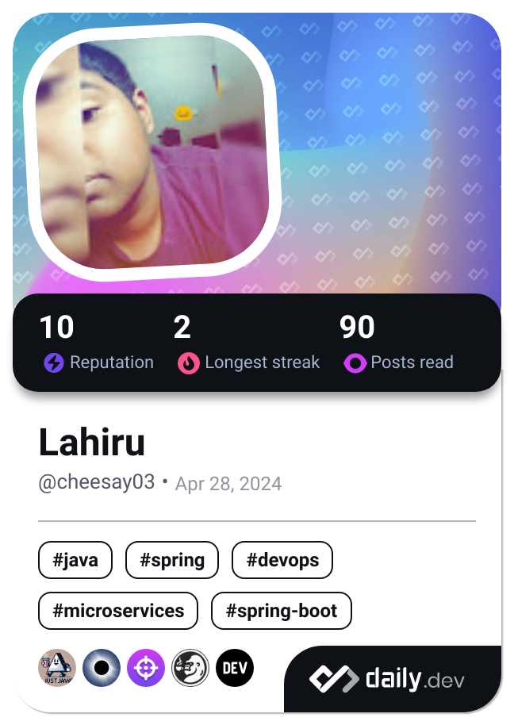

# 👋 Hi, I'm Lahiru Dahamapath (aka Cheese)

Welcome to my GitHub profile! I'm a passionate software developer specializing in building robust, scalable backend solutions. I enjoy creating clean and efficient code, and I'm always eager to learn new technologies and improve my skills.

## 🚀 Technologies I Specialize In:
- **Java**: My go-to language for building efficient, maintainable applications.
- **Spring Boot**: Creating RESTful APIs and microservices with ease.
- **SQL**: Database design, querying, and optimization.
- **AWS**: Deploying and managing cloud infrastructure.
- **Docker**: Containerizing applications for consistency and scalability.

## 📫 Connect With Me:
<!-- **LinkedIn**: [Your LinkedIn Profile URL]
- **Twitter**: [Your Twitter Handle] (optional) -->
- **Email**: rashmikadahampath7@gmail.com

Feel free to explore my projects, and don't hesitate to reach out if you'd like to collaborate!

---
*"Cheese makes everything better."* 🧀

